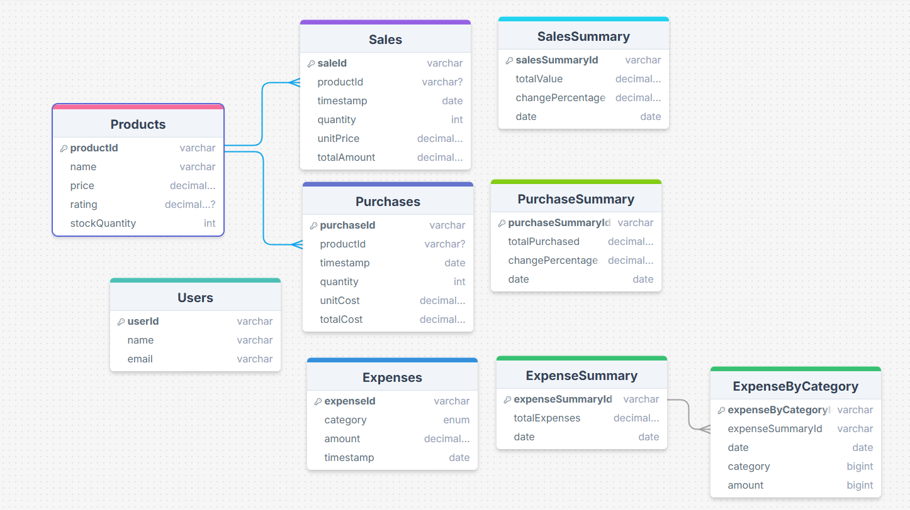

# Prisma Schema Documentation

This document provides detailed information about the database schema for the Inventory Management System.

## Database Configuration

The system uses PostgreSQL as the database provider, configured through an environment variable `DATABASE_URL`.

## Models Overview

### Users
- Primary identifier: `userId` (String)
- Stores basic user information including name and email
- Fields:
  - `userId`: String (Primary Key)
  - `name`: String
  - `email`: String

### Products
- Primary identifier: `productId` (String)
- Central model for product information
- Has one-to-many relationships with Sales and Purchases
- Fields:
  - `productId`: String (Primary Key)
  - `name`: String
  - `price`: Float
  - `rating`: Float (Optional)
  - `stockQuantity`: Integer
- Relations:
  - Has many `Sales`
  - Has many `Purchases`

### Sales
- Primary identifier: `saleId` (String)
- Records individual sale transactions
- Fields:
  - `saleId`: String (Primary Key)
  - `productId`: String (Foreign Key)
  - `timestamp`: DateTime
  - `quantity`: Integer
  - `unitPrice`: Float
  - `totalAmount`: Float
- Relations:
  - Belongs to one `Products` (via `productId`)

### Purchases
- Primary identifier: `purchaseId` (String)
- Records product purchase transactions
- Fields:
  - `purchaseId`: String (Primary Key)
  - `productId`: String (Foreign Key)
  - `timestamp`: DateTime
  - `quantity`: Integer
  - `unitCost`: Float
  - `totalCost`: Float
- Relations:
  - Belongs to one `Products` (via `productId`)

### Expenses
- Primary identifier: `expenseId` (String)
- Tracks general business expenses
- Fields:
  - `expenseId`: String (Primary Key)
  - `category`: String
  - `amount`: Float
  - `timestamp`: DateTime

### Summary Models

#### SalesSummary
- Primary identifier: `salesSummaryId` (String)
- Aggregates sales data
- Fields:
  - `salesSummaryId`: String (Primary Key)
  - `totalValue`: Float
  - `changePercentage`: Float (Optional)
  - `date`: DateTime

#### PurchaseSummary
- Primary identifier: `purchaseSummaryId` (String)
- Aggregates purchase data
- Fields:
  - `purchaseSummaryId`: String (Primary Key)
  - `totalPurchased`: Float
  - `changePercentage`: Float (Optional)
  - `date`: DateTime

#### ExpenseSummary
- Primary identifier: `expenseSummaryId` (String)
- Aggregates expense data
- Fields:
  - `expenseSummaryId`: String (Primary Key)
  - `totalExpenses`: Float
  - `date`: DateTime
- Relations:
  - Has many `ExpenseByCategory`

#### ExpenseByCategory
- Primary identifier: `expenseByCategoryId` (String)
- Breaks down expenses by category
- Fields:
  - `expenseByCategoryId`: String (Primary Key)
  - `expenseSummaryId`: String (Foreign Key)
  - `category`: String
  - `amount`: BigInt
  - `date`: DateTime
- Relations:
  - Belongs to one `ExpenseSummary` (via `expenseSummaryId`)

## Relationships

1. Products → Sales: One-to-Many
   - A product can have multiple sales records
   - Each sale is associated with one product

2. Products → Purchases: One-to-Many
   - A product can have multiple purchase records
   - Each purchase is associated with one product

3. ExpenseSummary → ExpenseByCategory: One-to-Many
   - An expense summary can have multiple category breakdowns
   - Each category breakdown belongs to one expense summary

## Data Types Used

- String: For IDs and text fields
- Float: For monetary values and percentages
- Integer: For quantities
- DateTime: For timestamps and dates
- BigInt: For large numerical values (used in ExpenseByCategory)
- Boolean: Not used in current schema

## Best Practices

1. All models use string-based IDs for maximum flexibility
2. Timestamps are used for tracking temporal data
3. Monetary calculations are stored as Float for precision
4. Optional fields are marked with '?' (e.g., product rating)
5. Related records are properly linked using foreign keys
